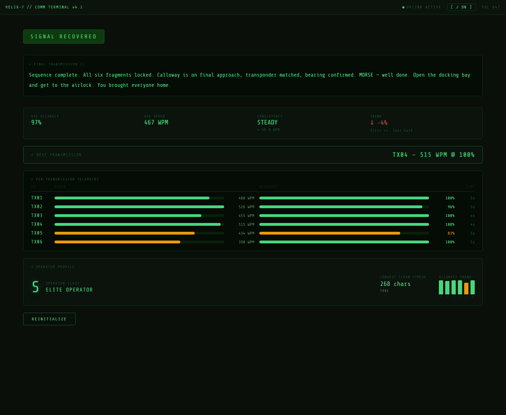

<div align="center">


# HELIX-7 // COMM TERMINAL

**A narrative typing game transmitted from deep space.**

Every keystroke rewrites the story. Every mistake costs the crew.

[](https://react.dev/)
[](https://vitejs.dev/)
[](#tech-stack)

[Play It](#getting-started) · [Report Bug](#) · [Request Feature](#)

</div>

---

> *"Establishing uplink to Earth Relay Station 4... Distress beacon acknowledged. Incoming coordinates will arrive in 6 fragments. Transcribe each one exactly. Errors corrupt the sequence. The Calloway is waiting. So is your crew."*

You are a comm operator receiving fragmented distress transmissions from a stranded vessel. Transcribe each one accurately to determine the outcome of the mission — and the fate of your crew. Type well, and the crew comes home. Type carelessly, and the signal — and the story — falls apart.

---

## ✨ Why it's interesting

- **🎮 Typing accuracy *is* the game** — there's no separate "choice" UI. How cleanly you transcribe each transmission silently steers the branching narrative toward one of three endings.
- **🔊 Fully synthesised audio, zero asset files** — the ambient drone pad, sonar pings, and every keystroke SFX are generated live with the Web Audio API. No `.mp3`, no `.wav`, nothing to load.
- **🌌 Hand-rolled WebGL shaders** — the nebula and meteor backgrounds are raw GLSL fragment shaders (no Three.js), including a `tanh()` polyfill for WebGL 1.
- **📡 No `<input>` element** — the entire typing surface is a `keydown`-driven `<div>`, built to avoid the quirks (autocomplete, IME, mobile keyboard behavior) that come with native text inputs.
- **📊 Real post-run analytics** — consistency (CV of WPM), accuracy trend across the run, best transmission, longest clean streak, and a composite operator grade (S→E) — all derived client-side from the run history.
- **📦 One dependency: React** — everything else (audio, graphics, story engine) is written from scratch.

---

## Table of Contents

- [Overview](#overview)
- [Gameplay](#gameplay)
- [Tech Stack](#tech-stack)
- [Project Structure](#project-structure)
- [Architecture](#architecture)
  - [Game State](#game-state)
  - [Branching Story System](#branching-story-system)
  - [Accuracy Engine](#accuracy-engine)
  - [Audio Engine](#audio-engine)
  - [WebGL Backgrounds](#webgl-backgrounds)
  - [Result Screen & Analytics](#result-screen--analytics)
- [Visual Design](#visual-design)
- [Accessibility](#accessibility)
- [Getting Started](#getting-started)
- [Build & Preview](#build--preview)
- [Step-by-Step Creation](#step-by-step-creation)
- [About](#about)

---

## Overview

**HELIX-7 // COMM TERMINAL** (`the-last-transmission`) is a browser-based typing game built with React and Vite. It combines a branching sci-fi narrative with real-time typing mechanics, a fully synthesised audio engine, custom WebGL shader backgrounds, and a detailed post-run analytics screen — all with zero runtime dependencies beyond React itself.

The aesthetic is deliberately retro: a phosphor-green CRT terminal with scanlines, a vignette, corner bracket accents, a glitching boot sequence, and a monospace font (`Share Tech Mono`). Every visual detail — animations, colour tokens, timing — is defined in a single CSS file.

---

## Gameplay

### Flow

The game has three phases:

| Phase | Description |
|---|---|
| `intro` | Animated boot sequence with a typewriter log, signal bars, a sequence-alignment progress bar, and a live UTC clock. The player presses **INITIALIZE TERMINAL** to begin. |
| `playing` | The player transcribes 6 incoming transmissions one at a time. A live HUD shows WPM, accuracy, and a cosmetic "reactor power" reading. A six-slot tracker marks completed transmissions. |
| `result` | A full mission debrief with animated stat cards, a per-transmission telemetry table, and an operator grade. |

### Branching

Each transmission is a node in a story graph stored in `src/data/story.json`. After the player submits a transcription (presses **Enter** once the full text is typed), the accuracy is evaluated:

- **≥ 80% accuracy** — the story follows the `good` branch to the next node.
- **< 80% accuracy** — the story follows the `bad` branch instead.

This continues for up to 6 transmissions. The accumulated path of choices leads to one of three endings:

| Ending  | Badge                                     |
|---------|-------------------------------------------|
| Good    | `SIGNAL RECOVERED` — phosphor green badge |
| Neutral | `PARTIAL RECOVERY` — amber badge          |
| Bad     | `SIGNAL LOST` — red badge                 |

### Typing Mechanics

- There is no `<input>` element. The typing area is a focusable `<div>` that captures raw `keydown` events.
- Each character in the target text is rendered as an individual `<span>` with one of four states: `correct` (green), `wrong` (red with red background tint), `cursor` (solid green block), or `pending` (dim green).
- **Backspace** deletes the last typed character. Overtyping past the target length is blocked.
- The player presses **Enter** to submit once the full target length is reached.
- Typographic punctuation is normalised so the player never needs special characters: em dash (`—`) and en dash (`–`) both match a regular hyphen (`-`), and curly quotes match straight quotes.

### Stats (Live & Final)

Live stats update on every keystroke:

- **WPM** — word count of the typed text divided by elapsed minutes (timer starts on the first keystroke of each transmission).
- **Accuracy** — percentage of characters typed correctly so far (0–100).
- **Power** — a cosmetic "reactor power" reading that decreases as transmissions stack up and as accuracy drops, for dramatic effect.

---

## Tech Stack

| Category       | Technology             | Notes                                                   |
|----------------|------------------------|---------------------------------------------------------|
| UI Framework   | React 18               | Hooks-only; no class components                         |
| Build Tool     | Vite 5                 | `@vitejs/plugin-react` for JSX transform                |
| Language       | JavaScript (JSX)       | No TypeScript                                           |
| Styling        | Vanilla CSS            | Single file, custom properties, no preprocessor         |
| Audio          | Web Audio API          | Zero asset files; fully synthesised at runtime          |
| Graphics       | WebGL 1 / GLSL ES 1.00 | Raw canvas, no Three.js or similar                      |
| Fonts          | Google Fonts           | `Share Tech Mono` — loaded via `<link>` in `index.html` |
| Testing        | Playwright             | Installed as a devDependency                            |

**Runtime dependencies:** `react`, `react-dom` only.

**DevDependencies:** `vite`, `@vitejs/plugin-react`, `playwright`.

---

## Project Structure

```
Helix7/
├── index.html                  # Entry HTML; loads Share Tech Mono, sets title
├── vite.config.js              # Vite config with @vitejs/plugin-react
├── package.json
└── src/
    ├── main.jsx                # ReactDOM.createRoot — mounts <App />
    ├── App.jsx                 # Root component: phase routing, intro animation,
    │                           # audio wiring, WebGL background selection
    ├── App.css                 # All styles: CSS custom properties, layout,
    │                           # animations, keyframes, reduced-motion overrides
    ├── audio.js                # Web Audio engine (SFX + generative score)
    ├── shaders.js              # GLSL ES 1.00 fragment shaders (NEBULA + METEOR)
    ├── data/
    │   └── story.json          # Branching story node graph
    ├── hooks/
    │   └── useGameState.js     # Central state hook: owns all game logic
    ├── logic/
    │   ├── accuracyEngine.js   # Pure functions: WPM, accuracy, char states, streak
    │   └── branchResolver.js   # Maps (node, accuracy) → next node id
    └── components/
        ├── StoryDisplay.jsx        # Renders the incoming transmission text
        ├── TypingInput.jsx         # Char-by-char typing area (div + keydown)
        ├── StatsBar.jsx            # Live WPM / Accuracy / Power HUD
        ├── TransmissionTracker.jsx # 6-slot TX01–TX06 progress strip
        ├── ResultScreen.jsx        # End-of-run debrief, analytics, operator grade
        └── ShaderField.jsx         # Full-viewport WebGL canvas renderer
```

---

## Architecture

### Game State

All game logic lives in a single custom hook: `src/hooks/useGameState.js`.

It owns:

| State                | Type                               | Description                                                                  |
|----------------------|------------------------------------|------------------------------------------------------------------------------|
| `nodeId`             | string                             | Current story node key (e.g. `'tx01'`)                                       |
| `typed`              | string                             | Everything the player has typed for the current transmission                 |
| `phase`              | `'intro' \| 'playing' \| 'result'` | High-level screen state                                                      |
| `stats`              | `{ wpm, accuracy }`                | Live typing metrics, updated on every keystroke                              |
| `nodeHistory`        | array                              | One record per completed transmission: `{ nodeId, accuracy, wpm, seconds, streak, chars }`                                                                                                                           |
| `transmissionNumber` | number                             | 1–6, used to drive audio intensity and the tracker UI                        |
| `startTime`          | ref                                | Timestamp of the first keystroke; `null` between transmissions               |
| `inputRef`           | ref                                | DOM ref to the typing area for programmatic focus                            |

Derived values are recomputed on every render from state: `node` (the current story node object), `target` (the text to transcribe), and `charStates` (the per-character state array from `accuracyEngine`).

When **Enter** is pressed and `typed.length >= target.length`, `handleComplete()` runs:
1. Calculates final accuracy, WPM, elapsed time, and longest streak.
2. Appends a record to `nodeHistory`.
3. Calls `resolveNext(node, accuracy)` to find the next node id.
4. If the result is a terminal node, advances to the `result` phase. Otherwise, advances the node id and resets `typed` and `startTime`.

### Branching Story System

The story is a JSON graph in `src/data/story.json`. Each node has:

```json
{
  "tx01": {
    "text": "The transmission text the player must type.",
    "good": "tx02a",
    "bad":  "tx02b"
  },
  "tx_end_good": {
    "text": "The closing message shown on the result screen.",
    "ending": "good"
  }
}
```

`src/logic/branchResolver.js` provides one pure function:

```js
resolveNext(node, accuracy)
// Returns the next node id, or null if the current node is terminal.
// accuracy >= 80 → node.good; below → node.bad
```

Terminal nodes carry an `ending` field (`'good'`, `'neutral'`, or `'bad'`) which drives the result screen badge and the audio stinger.

### Accuracy Engine

`src/logic/accuracyEngine.js` contains all pure measurement functions:

| Function            | Description |
|---|---|
| `normalizeChar(c)` | Maps typographic characters to plain equivalents (em dash → `-`, curly quotes → `'` / `"`) so special characters never block the player |
| `charsMatch(typedChar, targetChar)` | Normalise-then-compare for a single character pair |
| `calcAccuracy(typed, target)` | Integer 0–100: correct chars / typed.length. Empty string returns 100. |
| `calcWPM(typed, elapsedSeconds)` | Word count (whitespace-split) / elapsed minutes, rounded. Returns 0 if no time has elapsed. |
| `calcLongestStreak(typed, target)` | Longest consecutive run of correctly matched characters in a single transcription. |
| `getCharStates(typed, target)` | Returns an array of `'correct' \| 'wrong' \| 'cursor' \| 'pending'` for every character in `target`. |

### Audio Engine

`src/audio.js` is a self-contained Web Audio engine with no external assets.

**Initialisation**

The `AudioContext` is created lazily on the first call to `init()`. Browser autoplay policies typically suspend a freshly created context until a user gesture. `startOnLoad()` is called when the intro mounts and arms a one-shot listener on `pointerdown`, `mousedown`, `keydown`, and `touchstart` that resumes the context on the very first interaction — so the ambient score starts as soon as possible without waiting for the INITIALIZE button.

**Sound Effects**

| Function | Triggered by | Sound |
|---|---|---|
| `playKey(correct)` | Every printable keypress | A filtered-noise "click" via a band-pass filter on a noise buffer, plus a short oscillator blip. Correct keys: high-frequency (`1800 Hz`) bright click + `680 Hz` square wave. Wrong keys: low-frequency (`700 Hz`) dull click + `150 Hz` sawtooth. |
| `playEnter()` | Enter key (on a complete transcription) | Two ascending square-wave blips (`880 Hz` then `1174.7 Hz`), 60ms apart. |
| `playResult(kind)` | When the result screen appears | Four-note stinger played on triangle waves. Good ending: ascending (`C5→E5→G5→C6`). Bad ending: descending (`G4→E4→C4→G3`). Neutral: a question-mark contour (`C5→D5→C5→A4`). |

**Generative Score**

The background score has two layers:

1. **Drone pad** — four oscillators (root `A1`, octave `A2`, fifth `E3`, octave `A3`) run through a low-pass filter with a slow LFO sweep (`0.05 Hz`, ±240 Hz modulation depth) that gives the pad a slow breathing movement. The root uses a sine wave; the harmonics use sawtooth. The whole pad fades in over 5 seconds on start.

2. **Sonar pings** — a recurring random timer fires a single sine-wave ping at a random note from an A-minor-ish scale (`[220, 261.63, 293.66, 329.63, 392.0, 440.0, 523.25] Hz`). Pan is randomised per ping. Gap between pings narrows as `intensity` rises.

**Intensity** (set via `setIntensity(0..1)`) is driven by `transmissionNumber`. As the player progresses through the 6 transmissions, pings become more frequent and slightly louder, and at high intensity a 35% chance of an upper-octave ping adds tension.

**Mute** applies a fast gain ramp (`0.02s` time constant) on the master gain node rather than suspending the context, so unmuting is instant.

### WebGL Backgrounds

`src/components/ShaderField.jsx` is a generic full-viewport WebGL renderer. It draws one full-screen triangle per frame (a common shader-toy pattern: three vertices covering the clip-space square) and passes two uniforms to any fragment shader:

- `u_resolution` — canvas size in physical pixels
- `u_time` — elapsed seconds since mount

Two shaders are defined in `src/shaders.js`:

**NEBULA (intro screen)**

Domain-warped fractional Brownian motion (`fbm`) built from simplex noise. Two layers of `fbm` warp the UV coordinates, a third layer warps those results, and the final scalar drives a three-stop colour mix from a deep near-black through a mid green to a bright phosphor green. The warp uses time to slowly drift the field, giving the impression of phosphor wisps moving across a dark screen. Rendered at up to `2× DPR`.

**METEOR (gameplay / result)**

Phosphor-green streaks sweeping past like meteor tails. Twenty-two streak contributions are accumulated in a loop, each positioned by a cosine function of index and time and weighted by `1/length()` to produce a thin bright line. Tail noise is added via another `fbm`. A polyfilled `tanh4()` (since `tanh` is absent in GLSL ES 1.00) tone-maps the accumulation. Capped at `1× DPR` since it runs behind the opaque UI panels and only appears in the page margins. A subtle camera shake (sinusoidal UV offset, ±0.5%) adds micro-movement.

Both shaders respect `prefers-reduced-motion`: if the media query matches, `ShaderField` is not rendered at all and the background remains the plain dark CSS colour.

### Result Screen & Analytics

`src/components/ResultScreen.jsx` computes all analytics purely from the `nodeHistory` array (no server, no persistent storage).

| Metric | How It's Calculated |
|---|---|
| Avg Accuracy | Sum of per-transmission accuracy values / count |
| Avg WPM | Sum of per-transmission WPM values / count |
| Consistency | Standard deviation of WPM values across transmissions; labelled `STEADY` (CV < 0.15), `VARIABLE` (CV < 0.35), or `ERRATIC` |
| Trend | Average accuracy of the second half of transmissions minus the first half; displayed as `↑ +N%`, `↓ -N%`, or `→ 0%` |
| Best Transmission | The node with the highest combined score: `accuracy + (wpm / peakWpm) × 10` |
| Longest Clean Streak | The highest `streak` value across all transmission records |
| Operator Grade | A composite of average accuracy (90% weight) + a speed bump capped at 10 points (`avgWpm / 40 × 10`). Graded S → E across ten tiers. |

Headline stats (Avg Accuracy, Avg WPM) count up from 0 using a `useCountUp` hook that runs an `easeOutCubic` animation on `requestAnimationFrame`. Reduced-motion users get the final values immediately.

The per-transmission telemetry table renders speed and accuracy bars that grow in (`scaleX` from 0) staggered by `--row-delay` CSS custom property, one row at a time.

The accuracy sparkline in the operator profile renders one vertical bar per transmission, coloured by accuracy tier (green / amber / red), height proportional to accuracy percentage.

---

## Visual Design

The entire visual system is built on five CSS custom properties:

```css
--bg-deep:         #0a0f0a   /* Page background — near-black with a green tint */
--bg-screen:       #060c06   /* Deeper inset areas (typing area, story display) */
--bg-panel:        #0d130d   /* Surface panels (header, stats bar, result cards) */
--phosphor:        #4ade80   /* Primary text and correct characters */
--phosphor-dim:    #166534   /* Secondary labels, dim UI chrome */
--phosphor-muted:  #0f3d0f   /* Borders, inactive slots, very dim backgrounds */
--phosphor-pending:#5c8f66   /* Untyped characters — readable but clearly recessed */
--amber-warn:      #f59e0b   /* Warnings, neutral endings, active transmission dot */
--red-critical:    #ef4444   /* Wrong characters, bad endings, low accuracy */
```

Key animation effects:
- **`flicker`** — a 6-second opacity cycle on the entire `app-shell` simulating a CRT power fluctuation.
- **`scanPulse`** — the typing area border slowly pulses between `--phosphor-muted` and `--phosphor-dim`.
- **`glitchFlicker`** — a brief horizontal jitter on the intro boot block, fired every 8–12 seconds from JS.
- **`badgeReveal` + `badgeGlow`** — the ending badge snaps in with a slight overshoot, then pulses its border glow using `currentColor` so it automatically matches the ending tier colour.
- **`introVeil`** — a full-screen black `::after` pseudo-element that fades out as the intro mounts, so the result screen reads as fading through black before the terminal reboots.

---

## 📸 Preview

<div align="center">
  
  
</div>

---

## Accessibility

- All WebGL backgrounds are skipped for users with `prefers-reduced-motion: reduce`. The CSS `reduced-motion` block also disables all CSS animations and transitions on the result screen, the intro, and the typing cursor.
- The typewriter boot log is revealed all at once for reduced-motion users instead of character by character.
- The mute toggle carries an `aria-label` that updates to reflect current state.
- The shader canvas carries `aria-hidden="true"` since it is purely decorative.
- The typing area has `tabIndex={0}` so it is keyboard-reachable and auto-focused when the playing phase begins.

---

## Getting Started

**Prerequisites:** Node.js 18+

```bash
# Install dependencies
npm install

# Start the dev server
npm run dev
```

Open `http://localhost:5173` in your browser.

---

## Build & Preview

```bash
# Production build (outputs to /dist)
npm run build

# Preview the production build locally
npm run preview
```

Vite compiles JSX via Babel through `@vitejs/plugin-react`, bundles the app as ES modules, and produces a static `/dist` directory suitable for any static host.

---

## Step-by-Step Creation

Below is the full construction sequence of the project from scratch.

### 1. Scaffold with Vite

```bash
npm create vite@latest helix7 -- --template react
cd helix7
npm install
```

This produces `vite.config.js`, `index.html`, `src/main.jsx`, and a default `App.jsx`. The React plugin is registered via `@vitejs/plugin-react`.

`index.html` was then edited to: add the `Share Tech Mono` Google Fonts `<link>`, set the page title to `HELIX-7 // COMM TERMINAL`, and remove the default favicon.

### 2. Author the Story Data

`src/data/story.json` was written by hand as a flat key→object map. Each node specifies `text` (what the player transcribes), `good` and `bad` (branch keys for the next node), and optionally `ending` (`'good'`, `'neutral'`, `'bad'`) to mark terminal nodes. The story tree covers 6 transmission steps and branches into multiple endings.

### 3. Build the Logic Layer

**`src/logic/accuracyEngine.js`**

Pure functions with no dependencies. Written test-first to verify edge cases: empty typed strings, overtyped strings, typographic character normalisation, and WPM at elapsed time zero.

**`src/logic/branchResolver.js`**

A single exported function `resolveNext(node, accuracy)` that returns the next node id or `null`. Deliberately tiny so the branching rule (80% threshold) is explicit and easy to change.

### 4. Build the Central State Hook

`src/hooks/useGameState.js` was built to own everything that changes during a run — node, typed text, phase, stats, history, and the transmission counter. This keeps `App.jsx` as a pure render layer and makes the game logic independently testable.

The key design decision: the clock (`startTime` ref) starts on the first keystroke of each transmission, not when the node loads, so the WPM reading reflects actual typing speed rather than including reading time. The typed-length guard inside the `setTyped` updater (rather than reading `typed.length` from the closure) prevents overtyping under fast input where the closure value would be stale.

### 5. Build the Components

Components were built one at a time in dependency order:

1. **`StoryDisplay`** — stateless display of the current transmission text. The `key={text}` prop forces React to remount the element on text change, replaying the `fadeSlide` CSS animation.
2. **`TypingInput`** — maps `charStates` array to individually-styled `<span>` elements. No `<input>` element; all input is captured via `onKeyDown` on the `<div>`.
3. **`StatsBar`** — receives `wpm`, `accuracy`, and `transmissionNumber`; derives the cosmetic `power` value from them.
4. **`TransmissionTracker`** — six fixed slots; status (`done` / `active` / `locked`) derived from `nodeHistory.length`.
5. **`ResultScreen`** — built last, once the shape of `nodeHistory` records was stable. The `useCountUp` hook was added here to animate headline numbers.

### 6. Add the WebGL Backgrounds

`src/components/ShaderField.jsx` was written as a generic renderer first (vertex shader + uniform setup + resize handler + rAF loop), then the two shaders were developed separately in `src/shaders.js`:

- The NEBULA shader was written directly for the domain-warped fBm look desired for the intro.
- The METEOR shader was adapted from an existing aurora-style shader (originally blue/purple) and re-themed to phosphor green with the colour channels tuned to keep red and blue channels low.

The `tanh4` polyfill in the METEOR shader was needed because `tanh` is not available in GLSL ES 1.00 (the WebGL 1 shading language). It is implemented as `(1 - e^(-2x)) / (1 + e^(-2x))` applied component-wise to a `vec4`.

### 7. Build the Audio Engine

`src/audio.js` was written entirely without external libraries. The design goals were:
- No audio asset files in the build (fully synthesised).
- Start as early as possible despite browser autoplay restrictions.
- Score that dynamically responds to mission progress.

The noise buffer (20ms of white noise) is created once on init and reused for every key-click SFX by attaching a new band-pass filter at different frequencies for correct vs. wrong keystrokes. The drone pad uses a single low-pass filter node shared by all four oscillators; the LFO modulates the filter cutoff rather than individual oscillator outputs, which is more efficient and gives a unified breathing quality.

### 8. Wire Everything Together in `App.jsx`

`App.jsx` connects all layers:

- Reads game state from `useGameState`.
- Selects which shader to pass to `ShaderField` based on phase.
- Runs four `useEffect` hooks for: the typewriter boot log, the glitch timer, the UTC clock, and auto-focus on the typing area.
- Wraps `handleKeyDown` to fire the correct audio blip before delegating to the hook.
- Drives `audio.setIntensity` from `transmissionNumber`.
- Fires `audio.playResult` when the result phase begins.

### 9. Style the Full UI

`App.css` was built in one pass after the component structure was stable. Custom properties were defined first, then layout rules, then each component's styles, then keyframe animations, then the `prefers-reduced-motion` override block at the end that disables all animations for users who request it.

The fixed header required adding `padding-top: 60px` to `app-shell` so flow content was not hidden behind it. The intro screen uses `position: fixed` anchored between the header height (`42px`) and the footer height (`34px`) so its content centres in the visible viewport gap rather than the full document height.

### 10. Accessibility Pass

After the visual implementation was complete, a final pass added:
- `aria-hidden="true"` on all decorative elements (shader canvas, CRT overlay, corner brackets, signal bars, progress bar, status bar).
- `aria-label` on the mute toggle that reflects current state.
- The `prefers-reduced-motion` CSS block covering every animated element.
- Reduced-motion code path in `App.jsx` that skips the typewriter effect, skips the glitch timer, and skips `ShaderField` entirely.
- `useCountUp` in `ResultScreen` that snaps to the final value immediately for reduced-motion users.

---

## 🤝 Contributing

This is currently a solo project, but feedback, issues, and suggestions are always welcome. Feel free to open an issue if you spot a bug or have an idea.

---

## 👤 About

Built by **Angelito D. Tapawan III (Thirdy)** — Computer Engineering student and full-stack/AI developer with a background spanning automation, data engineering, and design-driven front-end work.

- Portfolio: [thirdy-tapawan-portfolio-cy9u.vercel.app](https://thirdy-tapawan-portfolio-cy9u.vercel.app/)
- LinkedIn: [angelito-tapawan-iii](https://www.linkedin.com/in/angelito-tapawan-iii/)
- GitHub: [@ThirdyTapawan](https://github.com/ThirdyTapawan)

<div align="center">
  <sub>Transmission received. Signal held. Crew status: your call.</sub>
</div>
